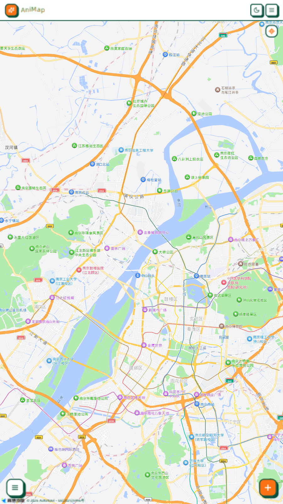
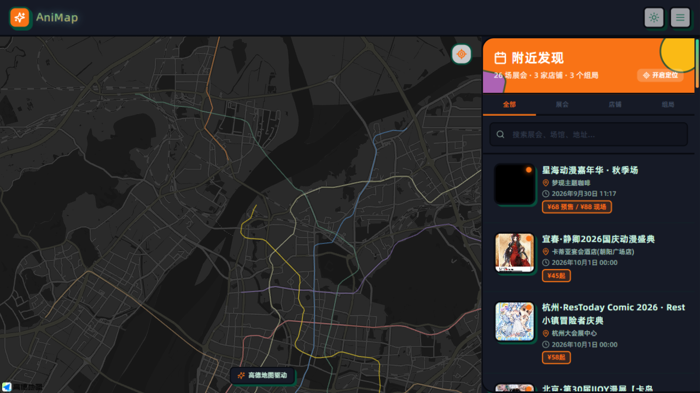
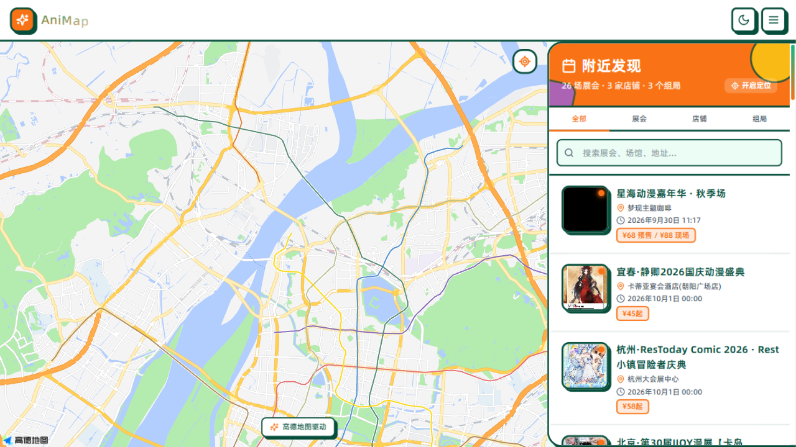
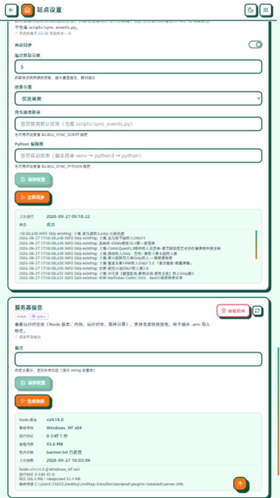
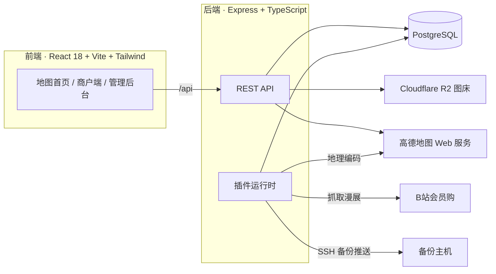

<div align="center">

# 🗺️ AniMap · 次元导航

**帮助 ACG 爱好者发现身边漫展、同人展与谷子店的聚合地图平台**

基于高德地图，把展会、店铺、组局画在同一张地图上 —— 找展、找店、找搭子，一网打尽。

[核心特性](#-核心特性) · [界面预览](#-界面预览) · [快速开始](#-快速开始) · [插件系统](#-插件系统) · [部署](#-部署) · [参与贡献](#-参与贡献)


</div>

---

## ✨ 核心特性

**找展 · 地图体验**

- 🗺️ 高德地图驱动，展会 / 店铺 / 组局一图全览，点击标记即看详情
- 🔍 按距离、城市、分类筛选，支持关键词搜索展会、场馆与地址
- 🌗 深色 / 浅色模式一键切换，圆形扩散过渡动画（View Transitions），地图随主题换肤
- 📱 移动端与桌面端深度适配，支持添加到主屏幕（PWA 体验）

**发展 · 完整的内容生态**

- 🏪 商户自主入驻，发布展会、店铺与组局，后台审核后上线
- 🎲 组局系统：桌游 / 剧本杀约局，报名管理、满员提醒一站搞定
- ❤️ 收藏与提醒：收藏的活动开始前自动邮件提醒
- 📧 邮件通知：验证码、审核结果、报名确认全流程覆盖

**管 · 为站长省心**

- 🧩 **插件化后台**：异地备份、AI 活动简介、数据体检、B站漫展同步全部插件化，支持 `.ami` 包导入 / 一键卸载（见 [插件开发指南](docs/PLUGIN_DEVELOPMENT.md)）
- 🤖 **B站自动同步**：定时抓取 B站会员购漫展信息，自动地理编码入库，新展自动上架
- ☁️ 异地容灾：配置一台备份主机的 SSH 地址与账号密码，测试连通后自动部署备份程序，每日定时推送数据库与配置
- 🖼️ R2 图床：海报自动生成多规格 WebP 变体并同步 Cloudflare R2，本地缺图自动回退原图
- 📊 数据体检：过期残留、缺失海报、悬空收藏等数据质量问题定时巡检

## 📸 界面预览

| 主页地图 | 深色模式 |
| --- | --- |
|  |  |

| 展会列表 | 管理后台 · 插件系统 |
| --- | --- |
|  |  |

## 🚀 快速开始

### 准备工作

- Node.js ≥ 18
- PostgreSQL ≥ 14（本地装好，或用 Docker：
  `docker run -e POSTGRES_PASSWORD=postgres -p 5432:5432 -d postgres:16`）
- [高德开放平台](https://lbs.amap.com/) 申请两个 Key：
  - **Web 端（JS API）**：前端地图渲染，需要配套的安全密钥 `securityJsCode`
  - **Web 服务**：后端地理编码（地址 → 经纬度）

### 后端

```bash
cd backend
cp .env.example .env            # 填入数据库密码与高德 Web 服务 Key
npm install
npm run migrate:dev             # 建表 + 种子管理员（读 .env 中 ADMIN_*）
node scripts/seed-local-demo.js # 可选：灌入演示展会 / 店铺 / 组局
npm run dev                     # 默认监听 http://localhost:3001
```

> [!TIP]
> 如果本机还没装 PostgreSQL，也可以在 `backend/.env` 里指向任何可用的 PG 实例（Docker、远程库均可），迁移脚本会自动建表。

### 前端

```bash
cd frontend
cp .env.example .env            # 填入高德 Web 端 Key 与安全密钥
npm install
npm run dev                     # 默认 http://localhost:3000
```

开发服务器已把 `/api` 与 `/uploads` 代理到本地后端；打开 <http://localhost:3000>，
用 `.env` 里配置的管理员账号登录 `/admin` 进入后台。

> [!TIP]
> 想看「B站漫展同步」跑起来？在后台 **插件管理 → B站漫展同步 → 立即同步**，
> 会真实抓取 B站会员购的漫展列表并自动地理编码入库（需要后端 `.env` 配好 `AMAP_WEB_SERVICE_KEY`）。

## 🧩 插件系统

后台功能全部基于统一的插件契约（`backend/src/plugins/types.ts`）实现，内置四个官方插件：

| 插件 | 说明 |
| --- | --- |
| `bilibili-sync` | B站会员购漫展同步：定时抓取 → 地理编码 → 入库 → 海报对账 |
| `offsite-backup` | 异地备份：SSH 推送模式，测试连接后自动部署备份程序，每日打包数据库与配置 |
| `ai-summary` | AI 活动简介：调用 OpenAI 兼容接口，为缺简介的过审活动补写描述 |
| `data-health` | 数据体检：只读巡检过期残留、缺失海报、悬空收藏等问题 |

插件支持 **`.ami` 包导入**（zip 格式的插件包，含 `manifest.json` + `plugin.cjs`）：
管理页上传即装、一键卸载、服务重启自动恢复。写一个自己的插件只需实现
`{ setup, status, run }` 契约：

```js
// my-plugin/plugin.cjs
module.exports = {
  manifest: {
    id: 'my-plugin',
    name: '我的插件',
    description: '一句话描述',
    version: '1.0.0',
    settings: [{ key: 'enabled', label: '启用', type: 'boolean', default: false }],
    runActions: [{ id: 'hello', label: '打个招呼' }],
  },
  setup(ctx) { /* PluginContext：设置存储 / 日志 / spawn 脚本 / 数据库 */ },
  async status() {
    return { fields: [{ label: '状态', value: '运行中', tone: 'success' }] };
  },
  async run(action) {
    return { started: true, running: false, message: 'Hello, AniMap!' };
  },
};
```

完整的打包、导入与安全模型说明见 **[docs/PLUGIN_DEVELOPMENT.md](docs/PLUGIN_DEVELOPMENT.md)**。

## 📦 部署

仓库提供 Ubuntu 一键部署脚本（Nginx + PM2 + Let's Encrypt 可选）：

```bash
sudo ./deploy.sh        # 交互式：装依赖、建库、生成配置、编译、迁移、上线
sudo ./update-app.sh    # 代码更新后增量发布（保留 .env / uploads / 数据库）
```

- 图片可选同步至 Cloudflare R2（`npm run reconcile-r2` 补账），未同步的变体自动回退原图
- 异地备份在管理页配置远端主机即可，无需手工 cron
- 更多说明见 [DEPLOYMENT.md](DEPLOYMENT.md) 与 [docs/PRODUCTION_STACK.md](docs/PRODUCTION_STACK.md)

生产环境常用命令：

```bash
pm2 list && pm2 logs animap-backend     # 进程与日志
sudo systemctl restart nginx            # 重载 Nginx
sudo -u postgres psql animap            # 连库
```

## 🏗️ 技术架构



## 📁 目录结构

```
├── frontend/                # React 18 + Vite + Tailwind 前端
│   └── src/pages/AdminSettings.tsx    # 管理后台（含插件管理页）
├── backend/
│   ├── src/plugins/         # 插件运行时（context / registry / loader / routes）
│   ├── src/routes/          # REST 路由（auth / events / venues / sessions ...）
│   ├── src/database/        # 建表与幂等迁移
│   └── scripts/             # 演示数据 / mock SSH 服务端 / R2 对账
├── examples/                # .ami 插件示例包（bilibili-sync、server-info）
├── docs/                    # 插件开发指南 / 生产架构 / 异地容灾手册
├── scripts/                 # B站爬虫（sync_events.py）等独立脚本
├── deploy.sh                # 一键部署
└── update-app.sh            # 增量更新
```

## 🤝 参与贡献

欢迎 Issue 与 PR！提交前请：

1. `npm run build` 保证前后端类型检查通过
2. 新功能请附上简要说明与截图
3. 新增后台能力请优先做成插件，而不是塞进核心路由

## 💬 联系方式

<p align="left">
  
  &nbsp;<b>QQ</b>：<b>3386579857</b>
</p>

交流合作、问题反馈、部署求助都可以直接加 QQ 联系（添加请备注来意）。

## 📄 License

[AGPL-3.0](LICENSE) © 2026 AniMap Contributors

> [!NOTE]
> **数据来源声明**：本项目「B站漫展同步」插件抓取的数据来自 B站会员购公开页面，
> 仅用于学习与个人使用，数据的准确性与实时性不做保证，如有侵权请联系删除。
> 地图能力来自 [高德开放平台](https://lbs.amap.com/)，使用需遵守其服务条款。
